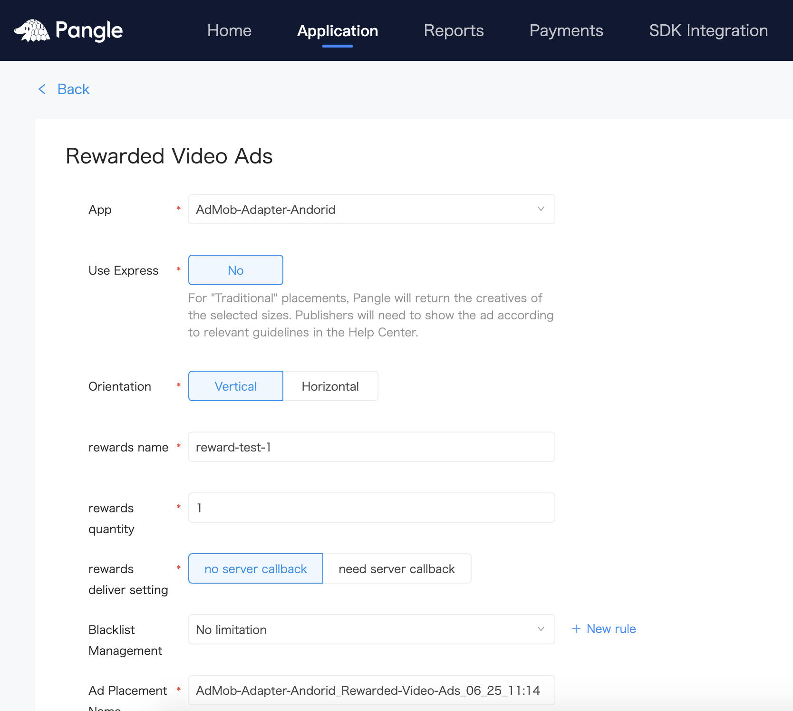
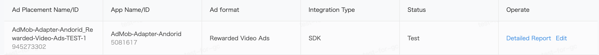
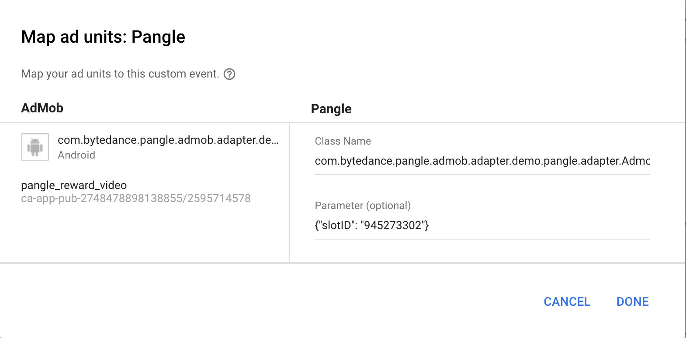

# pangle-admob-custom-adapter

> Please set [Admob](https://developers.google.cn/admob/android/quick-start) in your app first

## Setup Pangle
### Create App

- Add App

- Set App

### Create Ad Placement

## Add Pangle to AdMob's mediation

- Add adapter's [packagename].[adaptername] to Class Name.

- Add {"slotID": "your slot ID"} to Parameter.

**Please make sure to use JSON to set Parameter. Or you need to customize adapter yourself.**
