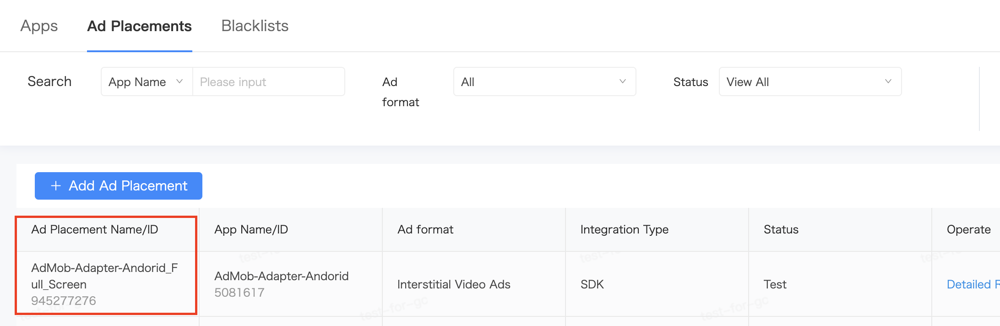
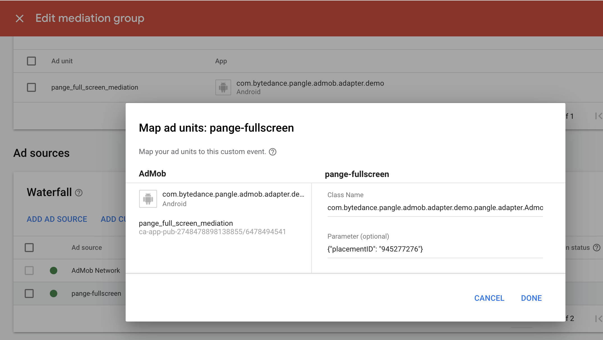
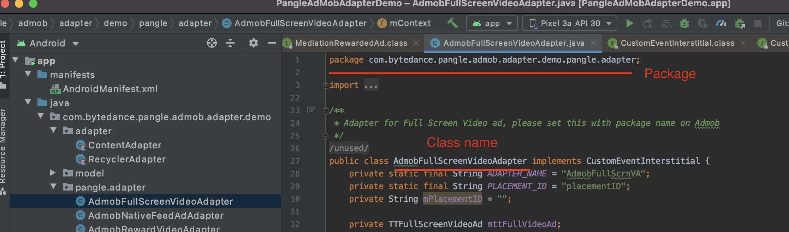

# AdMob Custom Event Adapter for Pangle

> Please set [Admob](https://developers.google.com/admob/android/quick-start) in your app first.

* Required Steps for integration
  * [Setup Pangle platform](#setup-pangle)
  * [Add Pangle to AdMob's mediation](#add-pangle)
    * [Create Mediation](#create-mediation)
    * [Set Class Name and Parameters](#set-classname)
      * [Class Name](#classname)
      * [Parameters](#parameter)
  * [Initialize Pangle SDK and adapters](#import-pangle)
    * [Pangle SDK's integration and initialize](#import-sdk)
    * [Embed Pangle adapters](#import-adapter)
      * [Gradle](#import-adapter-gradle)
      * [Manual Download](#import-adapter-manual)
* [Demo](#adapter-demo)

<a name="setup-pangle"></a>
## Setup Pangle Platform
### Create a Pangle account

- Please create a [Pangle account](https://www.pangleglobal.com/) if you do no have one.


### Create an application and placements in Pangle

- Click `Apps` -> `+ Add App` to create a app for mediation.


<a name="app-id"></a>
- You will get an app with its `app ID`.


### Create Ad Placement
- Click `Ad Placements` -> `+ Add Ad Placement` to create the placement for mediation.


- Select the ad's type for your app and finish the create.


<a name="placementID"></a>
- You will get a placement with its `placement ID`.




<a name="add-pangle"></a>
## Add Pangle to AdMob's mediation

<a name="create-mediation"></a>
### Create mediation

- Click `Mediation` -> `CREATE MEDIATION GROUP` to create a mediation group.


- Select the same ad format which created on Pangle side.


- After select the ad unit you created on AdMob which you want to embed mediation, click `ADD CUSTOM EVENT` to set with Pangle.


<a name="set-classname"></a>
### Set Class Name and Parameter

Set `Class Name` and `Parameter` in the mediation setting.



<a name="classname"></a>
#### Class Name
If you are using [gradle](#import-adapter-gradle) to integrate our adapters, please copy the contents below to `Class Name` .

|  Ad Type  |  Class Name  |
| ---- | ---- |
|  Reward Video Ads  |  com.google.ads.mediation.sample.customevent.adapter.AdmobRewardVideoAdapter  |
|  Interstitial(Fullscreen Video) Ads  |  com.google.ads.mediation.sample.customevent.adapter.AdmobFullScreenVideoAdapter  |
|  Banner Ads  |  com.google.ads.mediation.sample.customevent.adapter.AdmobTemplateBannerAdapter  |
|  Native Ads  |  com.google.ads.mediation.sample.customevent.adapter.AdmobNativeFeedAdAdapter  |


Else if you are integrating our adapters by **manual**, please add adapter's **package + adapter'class name** to `Class Name`.

|  Ad Type  | adapter'class name (need add `package` of your app ) |
| ---- | ---- |
|  Reward Video Ads  |  AdmobRewardVideoAdapter  |
|  Interstitial(Fullscreen Video) Ads  |  AdmobFullScreenVideoAdapter  |
|  Banner Ads  |  AdmobTemplateBannerAdapter  |
|  Native Ads  |  AdmobNativeFeedAdAdapter  |

  - for example,`com.bytedance.pangle.admob.adapter.demo.pangle.adapter.AdmobRewardVideoAdapter`

  

<a name="parameter"></a>
#### Parameter
Add `{"placementID":"your slot ID"}` to Parameter.

- **Parameter**: Add {"placementID":"[your placement ID on Pangle](#placementID)"} to Parameter , for example,`{"placementID":"1234567"}`

- **Please make sure to use JSON to set Parameter. Or you need to customize adapter yourself.**


<a name="import-pangle"></a>
## Initialize Pangle SDK and Adapter

<a name="import-sdk"></a>
### Import and Init Pangle SDK
Add `url 'https://artifact.bytedance.com/repository/pangle'` maven in the `allprojects` section of your project-level `build.gradle`.

```gradle
allprojects {
    repositories {
      maven {
        url 'https://artifact.bytedance.com/repository/pangle'
      }
    }
}
```

Next, open the app-level `build.gradle` file for your app, add `implementation 'com.pangle.global:ads-sdk:x.x.x.x'` in "dependencies" section.
In order to use the Android Advertising ID, we also recommend add  `com.google.android.gms:play-services-ads-identifier`.

```gradle
dependencies {
    ...
    implementation 'com.pangle.global:ads-sdk:3.8.1.2'
    implementation 'com.google.android.gms:play-services-ads-identifier:17.0.0'
    ...

}
```

Add following permissions and **provider** to your app's `AndroidManifest.xml`.

> :warning: Please make sure to add **provider** or ad's loading will not work properly.


```xml

<?xml version="1.0" encoding="utf-8"?>
<manifest xmlns:android="http://schemas.android.com/apk/res/android"
    package="xxxxxxxx">

    <!--Required  permissions-->
    <uses-permission android:name="android.permission.INTERNET" />
    <uses-permission android:name="android.permission.ACCESS_NETWORK_STATE" />
    <!-- If there is a video ad and it is played with textureView, please be sure to add this, otherwise a black screen will appear -->
    <uses-permission android:name="android.permission.WAKE_LOCK" />

    <application
        ...
        <!--Required->
        <provider
            android:name="com.bytedance.sdk.openadsdk.multipro.TTMultiProvider"
            android:authorities="${applicationId}.TTMultiProvider"
            android:exported="false" />

        ...

    </application>

</manifest>

```

Initialize Pangle SDK asynchronously is supported since the v3.5.0.0 SDK, please call `TTAdSdk.init(final Context var0, final TTAdConfig var1, final TTAdSdk.InitCallback var2)` to initializes the SDK before you send any ad requests. `init` only need to be called once per app’s lifecycle, we **strongly recommend** to do this on app launch.

`TTAdSdk.InitCallback` will be informed about the result of the initialize.

If you use TextureView for video ads, please set `useTextureView(true)` in the Builder and add add  `WAKE_LOCK`  permission in the manifest.


```kotlin
class PangleApplication: Application() {

    override fun onCreate() {
        super.onCreate()

        if (BuildConfig.DEBUG) {
            Timber.plant(Timber.DebugTree())
        }

        initSdk()
    }

    private fun initSdk() {
        TTAdSdk.init(this, buildAdConfig(), mInitCallback)
    }

    private val mInitCallback: TTAdSdk.InitCallback = object : TTAdSdk.InitCallback {
        override fun success() {
            Timber.d("init succeeded")
        }

        override fun fail(p0: Int, p1: String?) {
            Timber.d("init failed. reason = $p1")
        }
    }

    private fun buildAdConfig(): TTAdConfig {
        return TTAdConfig.Builder()
            // Please use your own appId,
            .appId("your_app_id")
            // Turn it on during the testing phase, you can troubleshoot with the log, remove it after launching the app
            .debug(BuildConfig.DEBUG)
            // The default setting is SurfaceView. We strongly recommend to set this to true.
            // If using TextureView to play the video, please set this and add "WAKE_LOCK" permission in manifest
            .useTextureView(true)
            // Fields to indicate whether you are a child or an adult ，0:adult ，1:child
            .coppa(0)
            .build()
    }
```


You also could check the initialization status with the method `TTAdSdk.isInitSuccess()`

```kotlin
private fun checkInitResult(): Boolean {
   return TTAdSdk.isInitSuccess()
}

```

Please refer to [Integrate Pangle SDK](https://www.pangleglobal.com/support/doc/6034a663511c57004360ff0f)
and [Initialize Pangle SDK](https://www.pangleglobal.com/support/doc/6034a671bc3f04003eef4f9f) for manual integration and more information.


<a name="import-adapter"></a>
### Embed Pangle Adapters

<a name="import-adapter-gradle"></a>
#### Gradle (preferred)
From our adapter v1.4.0, we support gradle integration.

Please open the app-level `build.gradle` file for your app, add `implementation 'com.pangle.global:adapter-for-admob:1.4.0'` in "dependencies" section.

<a name="import-adapter-manual"></a>
#### Manual download
- Click `SDK Integration` -> `SDK download`, you can download adapters for different ad formats from your Pangle platform.
<br>

<br>


Please unzip the file and add adapter files from Android folder into your application project. They can be used with no code changes. Also you can customize it for your use case.


<a name="adapter-demo"></a>
## Demo
- You can find simple use cases from [Demo](https://github.com/guchan-fout/andorid-pangle-admob-custom-adapter/tree/master/AndroidDemo).
