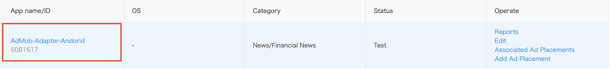
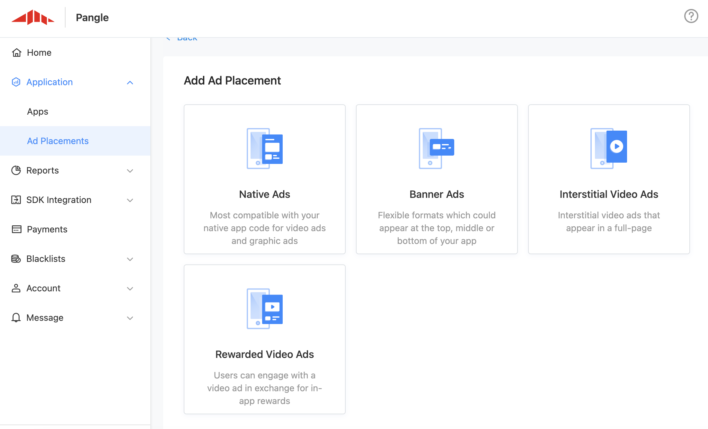
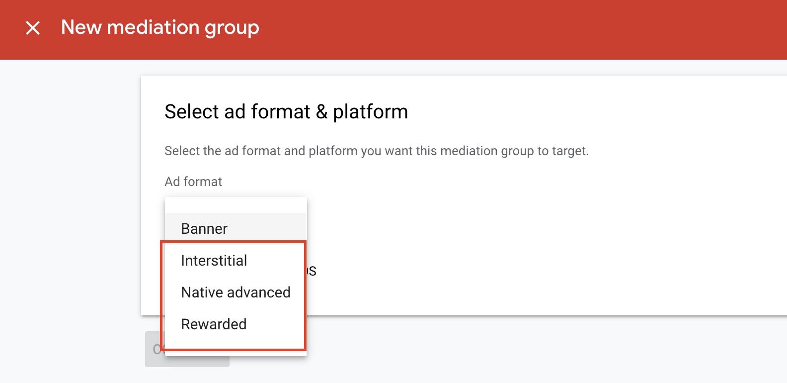
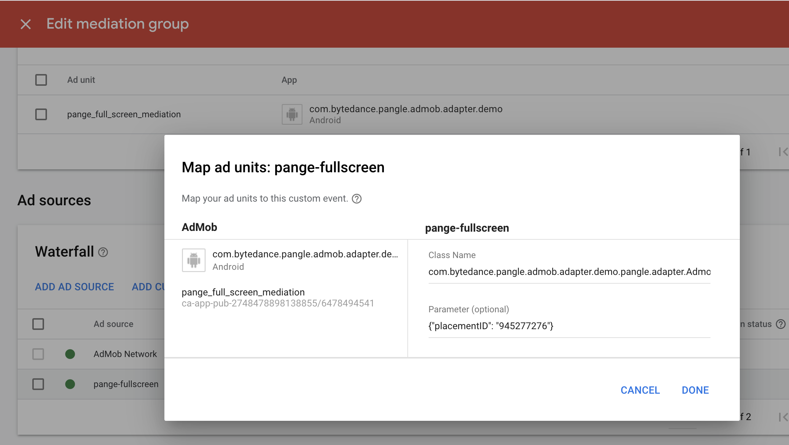
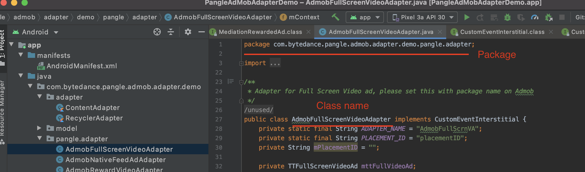
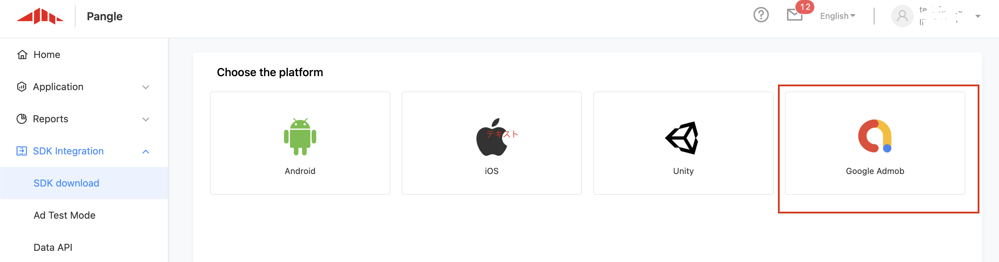
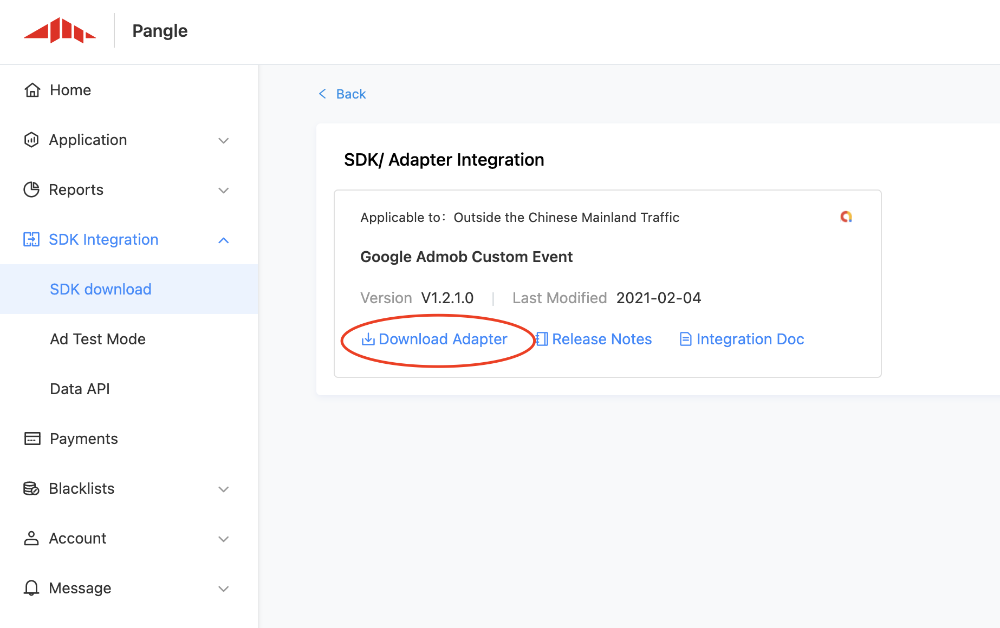
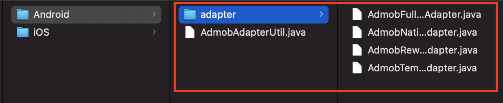

# AdMob Custom Event Adapter for Pangle

> Please set [Admob](https://developers.google.com/admob/android/quick-start) in your app first.

* 導入に必要な手順
  * [Pangleプラットフォームのセットアップ](#setup-pangle)
  * [AdMobのメディエーションにPangleを追加](#add-pangle)
    * [メディエーションを作成](#create-mediation)
    * [Class Name と Parametersを設定](#set-classname)
      * [Class Name](#classname)
      * [Parameters](#parameter)
  * [Pangle SDKとAdapterの導入と初期化](#import-pangle)
    * [Pangle SDKの導入と初期化](#import-sdk)
    * [Pangle Adaptersの導入](#import-adapter)
      * [Gradle](#import-adapter-gradle)
      * [手動導入](#import-adapter-manual)
* [Demo](#adapter-demo)

<a name="setup-pangle"></a>
## Pangleプラットフォームのセットアップ
### Pangleアカウントを作成

- [Pangleアカウント](https://www.pangleglobal.com/jp)をお持ちでない場合は作成してください。


### Pangleでアプリケーションとプレースメントを作成

- `Apps` -> `+ Add App` をクリックして、メディエーション用のアプリを作成します。
<br>

<br>


<a name="app-id"></a>
- `app ID`付いたアプリが作成されます。
<br>



### 広告プレースメントを作成する
- `Ad Placements` -> `+ Add Ad Placement`をクリックして、メディエーション用のアプリに属するプレースメントを作成します。
<br>


- 広告の種類を選択して、作成を完了します
<br>


<a name="placementID"></a>
- `placement ID`付きのプレースメントが作成されます。
<br>


<a name="add-pangle"></a>
## AdMobのメディエーションにPangleを追加

### メディエーションを作成

- `Mediation` -> `CREATE MEDIATION GROUP` をクリックして、メディエーショングループを作成します。
<br>


- Pangle側で作成したものと同じ広告フォーマットを選択します。
<br>



- メディエーション用のAdmob広告ユニットを選択したら、`ADD CUSTOM EVENT`をクリックしてPangleで設定します。
<br>


<a name="set-classname"></a>
### Class NameとParameterを設定

メディエーションの設定にて`Class Name` と `Parameter` を設定します。



<a name="classname"></a>
#### Class Name

[gradle](#import-adapter-gradle) を利用する場合、各広告タイプに対応する記載をそのまま `Class Name`にコピーしてください。

|  広告タイプ  |  Class Name  |
| ---- | ---- |
|  動画リワード広告 |  com.google.ads.mediation.sample.customevent.adapter.AdmobRewardVideoAdapter  |
|  インタースティシャル(フルスクリーン動画)広告  |  com.google.ads.mediation.sample.customevent.adapter.AdmobFullScreenVideoAdapter  |
|  バナー広告  |  com.google.ads.mediation.sample.customevent.adapter.AdmobTemplateBannerAdapter  |
|  ネイティブ広告  |  com.google.ads.mediation.sample.customevent.adapter.AdmobNativeFeedAdAdapter  |


**手動導入**時に、Adapterの`package name + adapterのclass name`をメディエーション上の`Class Name`枠に追加します。
- **Class Name**: [package].[adapter], 例：`com.bytedance.pangle.admob.adapter.demo.pangle.adapter.AdmobRewardVideoAdapter`

|  広告タイプ  | adapterのclass name (必ず`package`もClass Nameに記載 ) |
| ---- | ---- |
|  動画リワード広告 |  AdmobRewardVideoAdapter  |
|  インタースティシャル(フルスクリーン動画)広告  |  AdmobFullScreenVideoAdapter  |
|  バナー広告  |  AdmobTemplateBannerAdapter  |
|  ネイティブ広告  |  AdmobNativeFeedAdAdapter  |

  <br>
  

<a name="parameter"></a>
#### Parameter
`{"placementID":"your slotID"}`を`Parameter`枠に追加します。

   - **Parameter**: {"placementID":"[your placement ID on Pangle](#placementID)"}のJSON形式, 例：`{"placementID":"1234567"}`

   - **必ずJSON形式でパラメータを設定してください。または、アダプターを自分でカスタマイズする必要があります。**


<a name="import-pangle"></a>
## Pangle SDKとAdapterの導入と初期化

<a name="import-sdk"></a>
### Pangle SDKの導入と初期化

プロジェクトレベルの`build.gradle`の`allprojects`セクションのmavenに`url 'https://artifact.bytedance.com/repository/pangle'`を追加します。

```gradle
allprojects {
    repositories {
      maven {
        url 'https://artifact.bytedance.com/repository/pangle'
      }
    }
}
```

次に、アプリレベルの`build.gradle`を開き、`dependencies` セクションに`implementation 'com.pangle.global:ads-sdk:x.x.x.x'` を追加します。
 Android Advertising IDを使用するには、`com.google.android.gms：play-services-ads-identifier` を追加することもお勧めします。


```gradle
dependencies {
    ...
    implementation 'com.pangle.global:ads-sdk:3.8.1.2'
    implementation 'com.google.android.gms:play-services-ads-identifier:17.0.0'
    ...

}
```

アプリの `AndroidManifest.xml`に次の権限と**provider**を追加します。
> :warning: 必ず**provider**を追加してください。そうしないと、広告の読み込みが正しく機能しません。


```xml

<?xml version="1.0" encoding="utf-8"?>
<manifest xmlns:android="http://schemas.android.com/apk/res/android"
    package="xxxxxxxx">

    <!--Required  permissions-->
    <uses-permission android:name="android.permission.INTERNET" />
    <uses-permission android:name="android.permission.ACCESS_NETWORK_STATE" />
    <!-- If there is a video ad and it is played with textureView, please be sure to add this, otherwise a black screen will appear -->
    <uses-permission android:name="android.permission.WAKE_LOCK" />

    <application
        ...
        <!--Required->
        <provider
            android:name="com.bytedance.sdk.openadsdk.multipro.TTMultiProvider"
            android:authorities="${applicationId}.TTMultiProvider"
            android:exported="false" />

        ...

    </application>

</manifest>

```

広告リクエストを送信する前に、`TTAdSdk.init(final Context var0, final TTAdConfig var1, final TTAdSdk.InitCallback var2)`を呼び出してSDKを初期化してください。
`init`は、アプリのライフサイクルごとに1回だけ呼び出す必要があります。これは、アプリの起動時に行うことを**強くお勧め**します。

初期化の結果は`TTAdSdk.InitCallback`から通知されます。


動画広告に TextureView を使用する場合は、ビルダーで `useTextureView（true）`を設定し、マニフェストに `WAKE_LOCK` 権限を追加してください。

```kotlin
class PangleApplication: Application() {

    override fun onCreate() {
        super.onCreate()

        if (BuildConfig.DEBUG) {
            Timber.plant(Timber.DebugTree())
        }

        initSdk()
    }

    private fun initSdk() {
        TTAdSdk.init(this, buildAdConfig(), mInitCallback)
    }

    private val mInitCallback: TTAdSdk.InitCallback = object : TTAdSdk.InitCallback {
        override fun success() {
            Timber.d("init succeeded")
        }

        override fun fail(p0: Int, p1: String?) {
            Timber.d("init failed. reason = $p1")
        }
    }

    private fun buildAdConfig(): TTAdConfig {
        return TTAdConfig.Builder()
            // Please use your own appId,
            .appId("your_app_id")
            // Turn it on during the testing phase, you can troubleshoot with the log, remove it after launching the app
            .debug(BuildConfig.DEBUG)
            // The default setting is SurfaceView. We strongly recommend to set this to true.
            // If using TextureView to play the video, please set this and add "WAKE_LOCK" permission in manifest
            .useTextureView(true)
            // Fields to indicate whether you are a child or an adult ，0:adult ，1:child
            .coppa(0)
            .build()
    }
```


初期化結果は`TTAdSdk.isInitSuccess()`から確認できます。

```kotlin
private fun checkInitResult(): Boolean {
   return TTAdSdk.isInitSuccess()
}

```

手動導入や初期パラメータの設定などは[SDKの導入](https://www.pangleglobal.com/support/doc/6034a663511c57004360ff0f)
と [SDKの初期化](https://www.pangleglobal.com/support/doc/6034a671bc3f04003eef4f9f)をご参照ください。


<a name="import-adapter"></a>
### Pangle Adaptersの導入

<a name="import-adapter-gradle"></a>
#### Gradle (推奨)
Adapter v1.4.0 からCocoaPodsよりの導入をサポートします。

アプリレベルの`build.gradle`を開き、`dependencies` セクションに`implementation 'com.pangle.global:adapter-for-admob:1.4.0'` を追加すれば完了です。


<a name="import-adapter-manual"></a>
#### Manual download
Pangleプラットフォームから、`SDK Integration` -> `SDK download`からアダプターファイルをダウンロードしてください。
<br>

<br>


圧縮ファイルを解凍後にandroid用のアダプターファイルをアプリに導入すればコードを変更せずに使用できます。また、ユースケースに合わせてカスタマイズすることもできます。




<a name="adapter-demo"></a>
## Demo
- [Demo](https://github.com/guchan-fout/andorid-pangle-admob-custom-adapter/tree/master/AndroidDemo)から簡単な使用例を確認できます。
